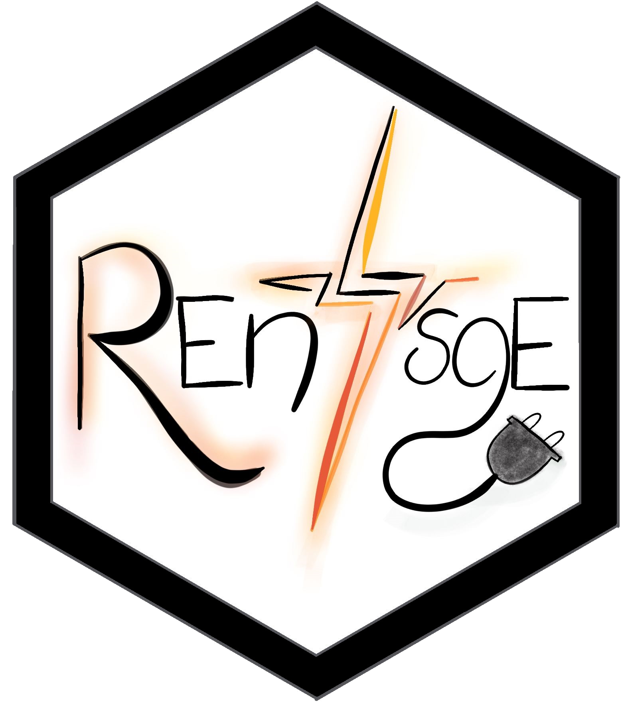

# REntsoE  

<!-- badges: start -->
[](https://app.codecov.io/gh/angryvoegi/REntsoE?branch=master)
[](https://github.com/angryvoegi/REntsoE/actions/workflows/R-CMD-check.yaml)
<!-- badges: end -->

R Package for the [Entso-E Transparency Platform](https://transparency.entsoe.eu/). 
The aim of this package is to get easy access to the (to date) Generation and Load data through the Entso-E API. 
The package is still being developed with the goal to pull every endpoint from the API.

## Installation

The development version of the package can be installed from
[GitHub](https://github.com/) with:

``` r
# install.packages("devtools")
devtools::install_github("angryvoegi/REntsoE")
```

## Pre-requisits

To get access to the data, you need a [Security Token](https://transparency.entsoe.eu/content/static_content/Static%20content/web%20api/Guide.html#_authentication_and_authorisation).

## How-to use

First, write your security token to the .Renviron of your R with 

```r
REntsoE::set_apikey("<YOUR_KEY>")
```

In a next step, in case you are not to familiar with the EIC codes, take a look at the following included datasets:

```r
head(REntsoE::areaY)
           EicCode   EicDisplayName                                   EicLongName EicParent EicResponsibleParty EicStatus MarketParticipantPostalCode MarketParticipantIsoCountryCode MarketParticipantVatCode                                                             EicTypeFunctionList type
1 14YCCPADATENMLDW         CCPACCP1                              CCP Austria GmbH                                  Active                                                                                   NA                                        Bidding Zone, Balance Group, Market Area    Y
2 14YEXAADATENML2F         EXAACCP2 EXAA Abwicklungsstelle für Energieprodukte AG                                  Active                                                                                   NA                                                      Market Area, Balance Group    Y
3 14YEXAADATENMLDU          EXAACCP EXAA Abwicklungsstelle für Energieprodukte AG                                  Active                                                                                   NA                                        Balance Group, Bidding Zone, Market Area    Y
4 10Y1001A1001A81J      IT-NORTH_FR                            Italy North_France                                  Active                                                                                   NA                                                                    Bidding Zone    Y
5 10Y1001A1001A85B IT-MACRZONESOUTH           Market Balance Area MACROZONE SOUTH                                  Active                                                                                   NA                                                                 Scheduling Area    Y
6 10Y1001A1001A91G      NORDIC_AREA                            Nordic Market Area                                  Active                                                                                   NA Outage Coordination Region, LFC Block, Capacity Calculation Region, Market Area    Y             
```

The list `codeList` has 27 different tables inside. The following tables are available:

```r
names(REntsoE::codeList)
 [1] "UnitOfMeasureTypeList"     "TarifTypeTypeList"         "StatusTypeList"            "RoleTypeList"              "RightsTypeList"            "ReasonCodeTypeList"       
 [7] "QualityTypeList"           "ProcessTypeList"           "PriceDirectionTypeList"    "PriceCategoryTypeList"     "PaymentTermsTypeList"      "ObjectAggregationTypeList"
[13] "IndicatorTypeList"         "EicTypeList"               "EnergyProductTypeList"     "DocumentTypeList"          "DirectionTypeList"         "CurveTypeList"            
[19] "CurrencyTypeList"          "ContractTypeList"          "CodingSchemeTypeList"      "ClassificationTypeList"    "CategoryTypeList"          "BusinessTypeList"         
[25] "AuctionTypeList"           "AssetTypeList"             "AllocationModeTypeList"  
```

Different data points require different variables. To date, following data points are implemented in the package. Behind the name, the used name from the [API documentation](https://transparency.entsoe.eu/content/static_content/Static%20content/web%20api/Guide.html#_load_domain) and from the [Knowledge Base](https://transparency.entsoe.eu/content/static_content/Static%20content/knowledge%20base/knowledge%20base.html) is included.

-  Actual Total Load [6.1.A]                | - Day-Ahead Total Load Forecast [6.1.B]
-  Week-Ahead Total Load Forecast [6.1.C]   | - Month-Ahead Total Load Forecast [6.1.D]


# Acknowledgement

I am incredibly thankful to my girlfriend Bianca Siegrist for her talent and creativity in crafting a beautiful logo for my project. 
